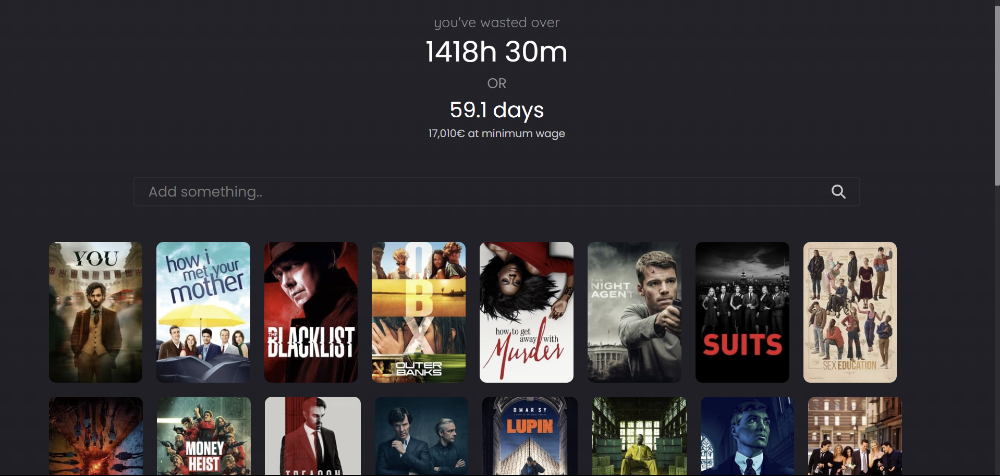
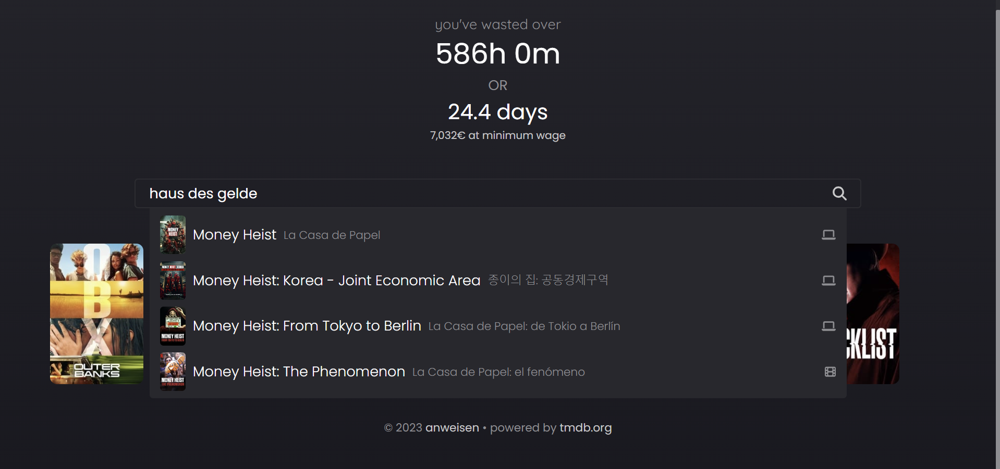
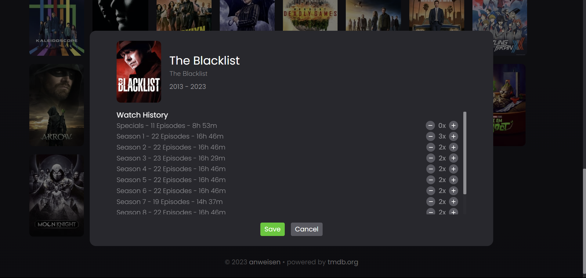

# WatchHistory - time wasted watching

Calculate your time spent watching tv series.  
You can also adjust the rewatches for each season of the show

Live Demo: [watched.anweisen.net](https://watched.anweisen.net)

## Time Calculation

The page uses the [TheMovieDatabase API](https://developer.themoviedb.org/docs) 
as the data source.

Because the api does not give concrete information about the runtime of shows,
the script must make a request for every season of the show.

This procedure is very resource draining and can add up to multiple hundreds or thousands of requests
for even a small medium amount of shows entered.

## Screenshots

### Overview

### Search for Shows

### Enter Rematches

